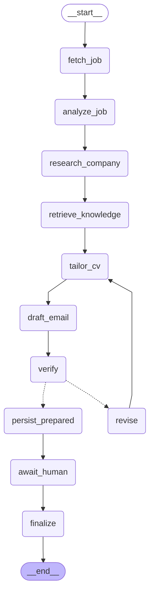

# Application preparation graph

Generated by `scripts/export_graph_mermaid.py` from `backend/src/linkedin_agent/graphs/application_graph.py`. Do not edit by hand.

```mermaid
---
config:
  flowchart:
    curve: linear
---
graph TD;
	__start__([<p>__start__</p>]):::first
	fetch_job(fetch_job)
	analyze_job(analyze_job)
	research_company(research_company)
	retrieve_knowledge(retrieve_knowledge)
	tailor_cv(tailor_cv)
	draft_email(draft_email)
	verify(verify)
	revise(revise)
	persist_prepared(persist_prepared)
	await_human(await_human)
	finalize(finalize)
	__end__([<p>__end__</p>]):::last
	__start__ --> fetch_job;
	analyze_job --> research_company;
	await_human --> finalize;
	draft_email --> verify;
	fetch_job --> analyze_job;
	persist_prepared --> await_human;
	research_company --> retrieve_knowledge;
	retrieve_knowledge --> tailor_cv;
	revise --> tailor_cv;
	tailor_cv --> draft_email;
	verify -.-> persist_prepared;
	verify -.-> revise;
	finalize --> __end__;
	classDef default fill:#f2f0ff,line-height:1.2
	classDef first fill-opacity:0
	classDef last fill:#bfb6fc

```
