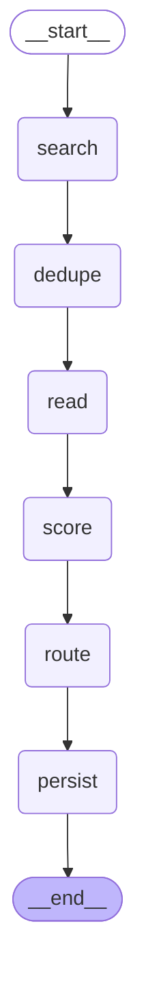

# Watch graph

Generated by `scripts/export_graph_mermaid.py` from `backend/src/linkedin_agent/graphs/watch_graph.py`. Do not edit by hand.

```mermaid
---
config:
  flowchart:
    curve: linear
---
graph TD;
	__start__([<p>__start__</p>]):::first
	search(search)
	dedupe(dedupe)
	read(read)
	score(score)
	route(route)
	persist(persist)
	__end__([<p>__end__</p>]):::last
	__start__ --> search;
	dedupe --> read;
	read --> score;
	route --> persist;
	score --> route;
	search --> dedupe;
	persist --> __end__;
	classDef default fill:#f2f0ff,line-height:1.2
	classDef first fill-opacity:0
	classDef last fill:#bfb6fc

```
